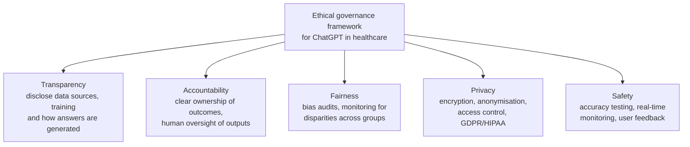

# ⚖️ Governing ChatGPT in Medical Chatbots: Ethics, Trust & Compliance

A research paper on what it takes to deploy a large language model (ChatGPT, versions 3–4) safely inside a **medical chatbot**. It maps the regulatory landscape (**EU AI Act, GDPR, HIPAA**), identifies the main governance, trust and ethical risks, and proposes a **governance framework** for healthcare organisations.

📄 **[Read the full paper (PDF)](paper/chatgpt_medical_chatbot_governance.pdf)**

---

## Why it matters

LLM chatbots can triage questions, educate patients and reduce clinician workload. They also process sensitive health data, can give confident but wrong medical advice, and sit in a legal grey area when something goes wrong. Under the EU AI Act, a medical chatbot is likely to count as a **high-risk** AI system.

## The five critical issues identified

| Issue | The risk |
|---|---|
| **Regulatory compliance** | Health data falls under GDPR (and HIPAA in the US). Rules for generative AI are still catching up with the technology |
| **Transparency & explainability** | Clinicians and patients cannot see how the model reached an answer or what it was trained on |
| **Algorithmic bias** | Bias can come from training data *and* model design, leading to unequal care for different groups |
| **Data privacy & confidentiality** | Chat logs contain medical histories and test results, so a breach is a serious harm |
| **Legal responsibility** | AI has no legal status. When a patient is harmed, it's unclear whether the hospital, the vendor or the user is liable |

The paper also applies the **"Cs of Generative AI"** lens (Control, Consequences, Correctness) and change-management models (TAM, NASSS) to adoption in clinical settings.

## Proposed governance framework

**Key recommendation:** treat the chatbot as a tool that *supports* clinicians rather than replaces them. Pair technical controls (encryption, access control, bias audits) with organisational ones (risk assessments, clear accountability, ongoing monitoring) to meet EU AI Act and GDPR requirements.

---

## Why this is relevant to my work

I build data systems in clinical research, where participant data, access control and auditability are everyday concerns. This paper shaped how I think about **role-based access, data minimisation and explainability** in health-data platforms. It also connects to my wider interest in **trustworthy and secure AI**.

*Written for the Analytics: Ethics, Trust and Governance module of my MSc Big Data Analytics, University of Derby, 2024.*
